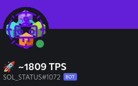
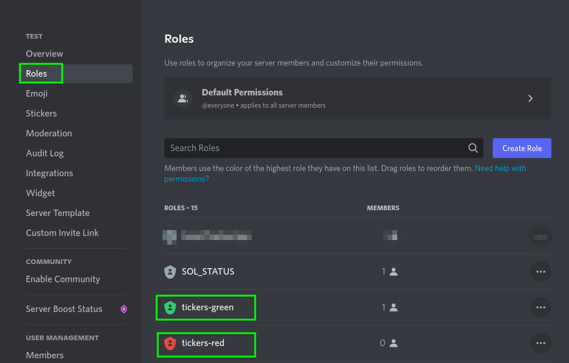

# SolanaStatus_BOT


This repo contains a Discord bot that is monitoring the SolanaBlockchain.


## Current Feature:

- Display current tps (Transactions per Second)

## View




## Discord-Settings:

- ### BOT Permissions
    - Manage Role
    - Change Nickname
- ### BOT Roles
    - tickers-red
    - tickers-green

Create 2 Roles in you Discord Server so the bot will change its Nickname color based on that.



### ENV

- Required:

```gitignore
RUST_LOG=error
DISCORD_TOKEN=<DISCORD_TOKEN>
LOOP_SLEEP=60
UPDATE_NAME=true
USER_ID=<BOT_USER_ID>
COLOR_THRESHOLD=999
```

- Oprional:

```gitignore
SOLANABEACH_TOKEN=<CAN BE EMPTY>
```

## Deploy via Docker

- Copy the `docker-compose.yaml.sample` to `docker-compose.yaml`
- Add you Token and later and BOT_ID
- Start you BOT with `docker-compose up -d`

### Donations:

- Solana-Wallet: `coffeeplease.sol`
- ETH-Address: `0xB0Be2420cA00C86aD983F246DEF49EA0F9779DCd`
